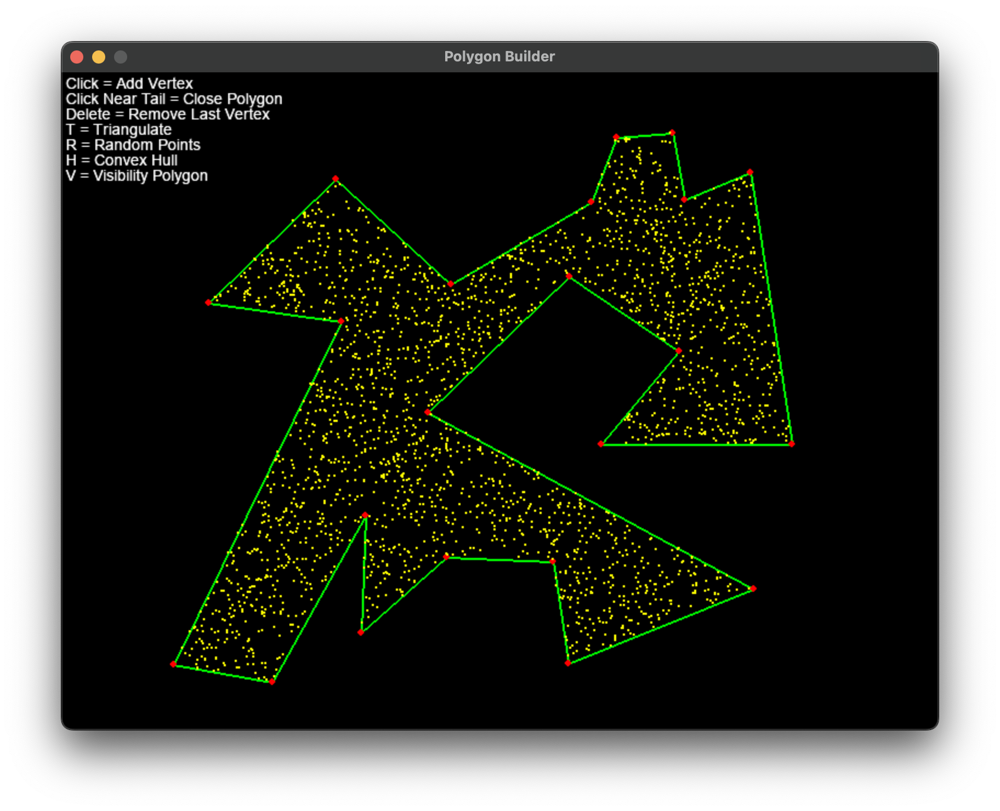
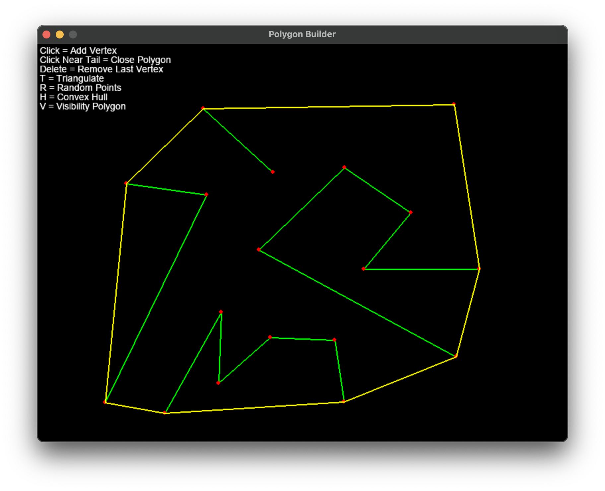
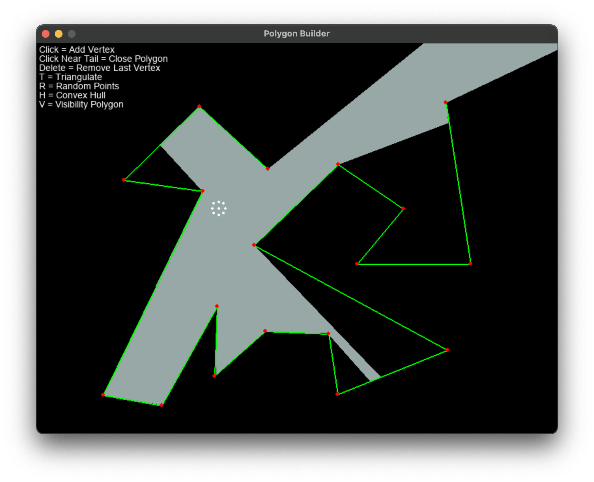

# Polygon Utilities

A **simple** tool to build **simple** polygons

## Included Utilities
- Counter clockwise testing
- Self-intersection testing
- Point in polygon testing
  - Winding number
  - Ray casting
- Ear clipping triangulation
- Sample points within a polygon
  - Rejection sampling
  - Triangulation sampling
- Convex hull algorithms
  - Gift wrapping
  - Graham's scan
- Visibility polygon

 
 
 
 

